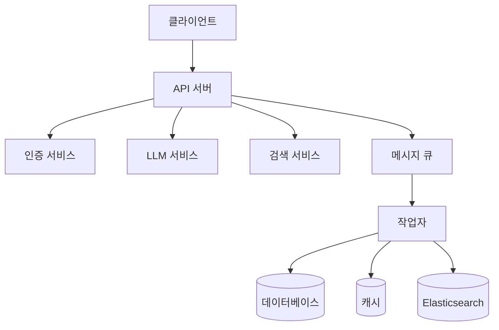
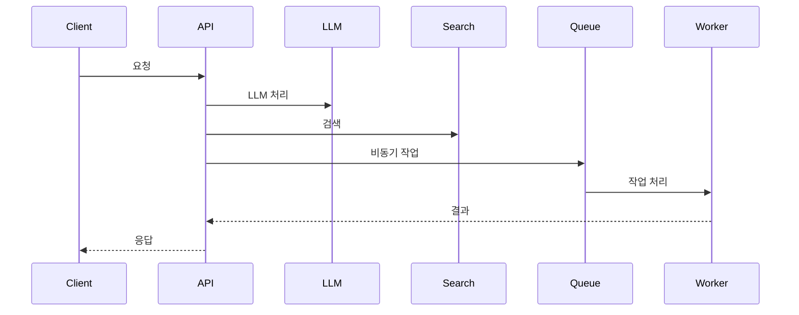

# 아키텍처 문서

## 개요

LLM Agent는 모듈화된 마이크로서비스 아키텍처를 기반으로 설계되었습니다. 이 문서는 시스템의 전반적인 구조와 각 컴포넌트의 역할을 설명합니다.

## 시스템 구조

### 핵심 컴포넌트

1. [API 서버](./api_server.md)
   - FastAPI 기반의 REST API 서버
   - WebSocket 지원
   - 인증 및 권한 관리

2. [LLM 서비스](./llm_service.md)
   - 대규모 언어 모델 통합
   - 프롬프트 관리
   - 응답 생성 및 최적화

3. [검색 서비스](./search_service.md)
   - Elasticsearch 기반 검색
   - 문서 인덱싱
   - 의미론적 검색

4. [메시지 큐](./message_queue.md)
   - RabbitMQ 기반 메시징
   - 비동기 작업 처리
   - 이벤트 기반 통신

### 인프라스트럭처

1. [데이터베이스](./database.md)
   - PostgreSQL 데이터 저장
   - Alembic 마이그레이션
   - 데이터 모델링

2. [캐시](./cache.md)
   - Redis 캐싱
   - 세션 관리
   - 레이트 리밋

3. [모니터링](./monitoring.md)
   - Prometheus 메트릭스
   - Grafana 대시보드
   - OpenTelemetry 추적

## 시스템 다이어그램

### 전체 아키텍처

### 데이터 흐름

## 확장성

### 수평적 확장
- API 서버 클러스터링
- 작업자 노드 추가
- 데이터베이스 샤딩

### 수직적 확장
- 리소스 할당 증가
- 캐시 메모리 확장
- 검색 인덱스 최적화

## 보안

### 인증 및 권한
- JWT 기반 인증
- 역할 기반 접근 제어
- API 키 관리

### 데이터 보안
- 암호화 전송
- 데이터 암호화
- 감사 로깅

## 성능 최적화

### 캐싱 전략
- 응답 캐싱
- 세션 캐싱
- 검색 결과 캐싱

### 데이터베이스 최적화
- 인덱싱
- 쿼리 최적화
- 커넥션 풀링

## 장애 복구

### 고가용성
- 서비스 중복화
- 로드 밸런싱
- 장애 감지

### 백업 및 복구
- 데이터 백업
- 로그 관리
- 복구 절차 